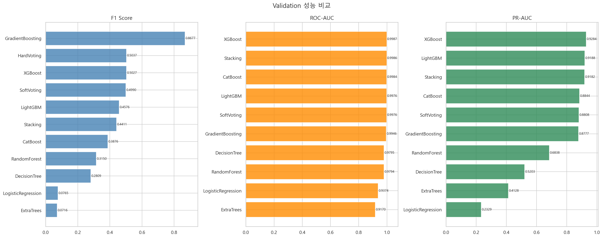
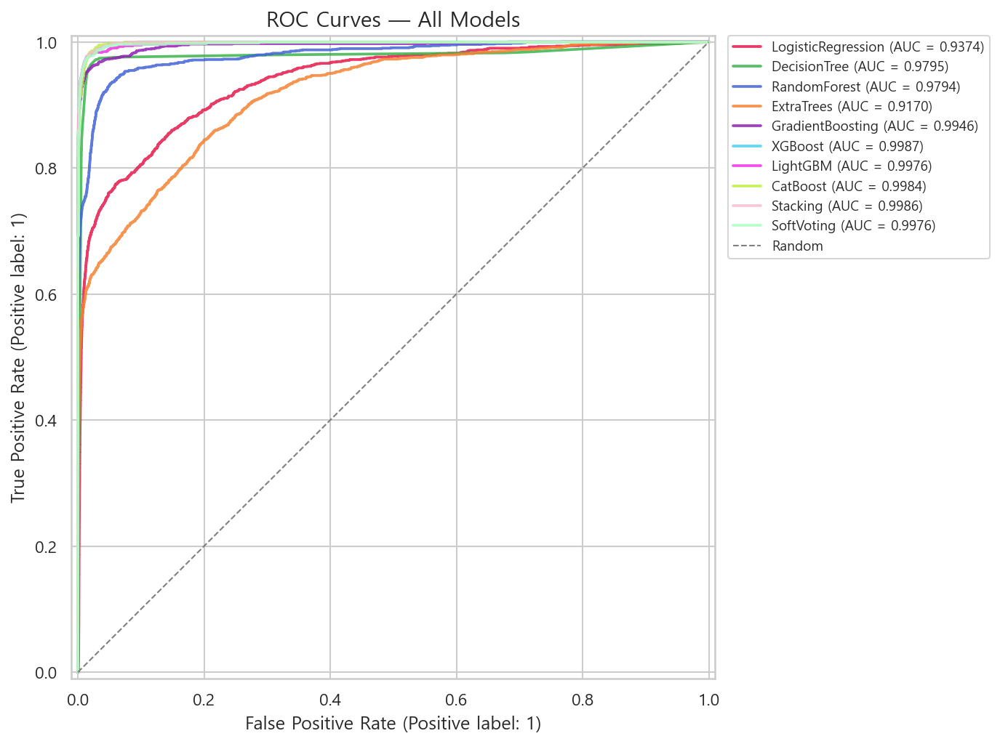
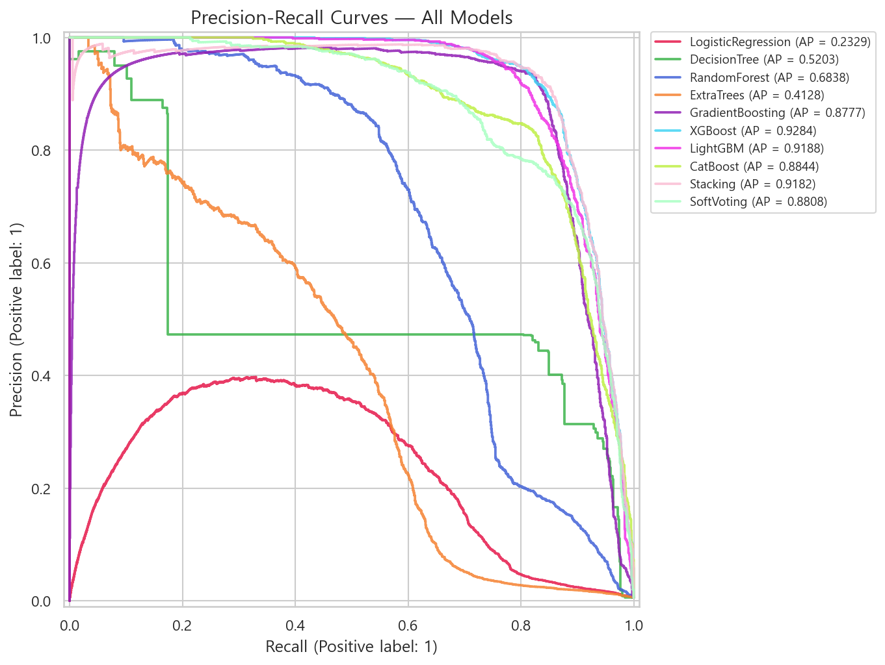
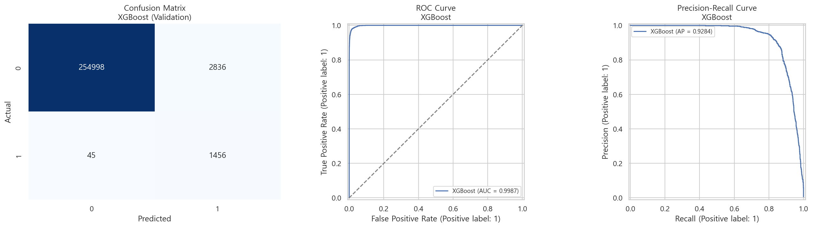
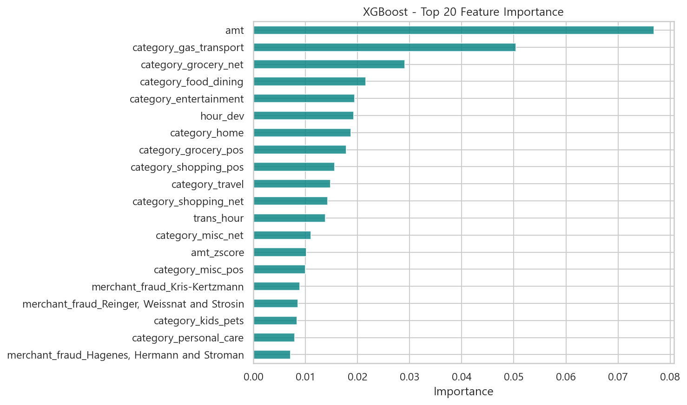
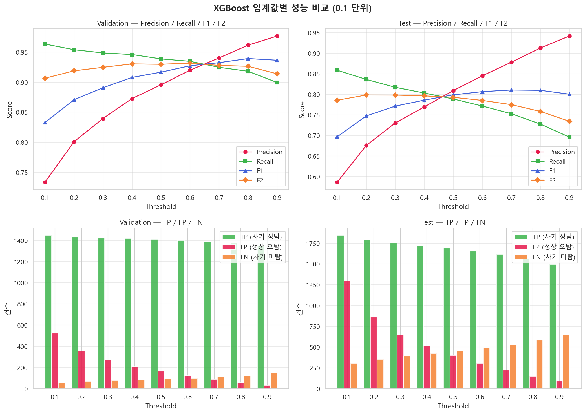
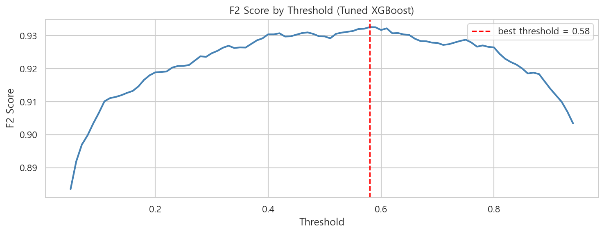
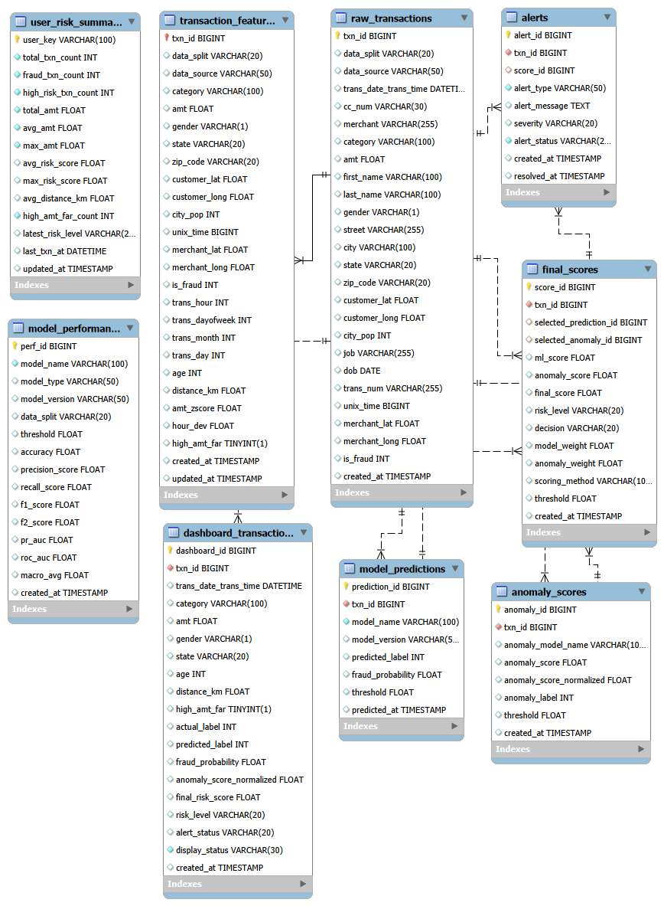

# FinGuard - ML 기반 신용카드 이상거래 탐지 시스템

> 신용카드 거래 데이터를 기반으로 이상거래를 탐지하고,
> **Rule-based Risk Score + ML Score + Anomaly Score**를 결합한 **Final Score**로 고위험 거래를 선별하는 이상거래 탐지 대시보드 프로젝트입니다.

<br>

## 0. 팀원 소개 및 기술 스택

### 👨‍👩‍👧‍👦 팀원 소개


| 이름 | 역할 |
|:------|:------|
| [송민지](https://github.com/nowis1350) | 프론트엔드 및 스트림릿 |
| [정영석](https://github.com/YoungSton3) | 데이터 분석 및 모델 학습 |
| [김재홍](https://github.com/kkix1025) | 기획 및 설계 / 프론트엔드 |
| [임준억](https://github.com/gripgrap) | DB 구축 및 백엔드 연결 |

<br>

### 🛠 기술 스택

### 🧠 Machine Learning / Deep Learning


### 📊 Data Analysis


### 📈 Visualization


### 🌐 Web App


### 💾 Database / ORM


### ⚙️ Utilities


## 1. 프로젝트 소개

신용카드 이상거래 탐지는 고객의 금융 피해를 줄이고, 금융사의 리스크를 낮추기 위해 중요한 문제입니다.
기존의 단순 Rule 기반 탐지는 명확한 조건을 빠르게 판단할 수 있다는 장점이 있지만, 새로운 이상거래 패턴이나 복합적인 위험 요인을 충분히 반영하기 어렵다는 한계가 있습니다.

본 프로젝트는 이러한 한계를 보완하기 위해 다음 세 가지 탐지 관점을 결합했습니다.

| 구분                    | 역할                                    |
| --------------------- | ------------------------------------- |
| Rule-based Risk Score | 거래 금액, 시간, 거리 등 설명 가능한 규칙 기반 위험 점수 산출 |
| ML Score              | XGBoost 기반 이상거래 예측 확률 산출              |
| Anomaly Score         | AutoEncoder 기반 비정상 거래 패턴 점수 산출        |

최종적으로 세 점수를 결합한 **Final Score**를 통해 거래 위험도를 정량화하고, 거래를 `Pass`, `Review`, `Block` 단계로 구분하는 구조를 설계했습니다.

<br>

## 2. 프로젝트 목표

* 신용카드 이상거래 탐지 모델 구축
* 불균형 데이터 환경에서 적절한 평가 지표 선정
* 다양한 머신러닝 모델 비교 및 최적 모델 선정
* Rule 기반 점수와 ML 모델, 이상 탐지 모델을 결합한 Final Score 설계
* Threshold 조정에 따른 탐지 성능 변화 시뮬레이션 제공
* Streamlit 기반 이상거래 탐지 대시보드 구현
* MySQL DB 기반 데이터 구조 설계 및 CSV fallback 구조 적용

<br>

## 3. 핵심 기능

| 기능     | 설명                                                           |
| ------ | ------------------------------------------------------------ |
| 메인 페이지 | 전체 거래 수, 이상거래 수, Fraud 비율, Block 피해 추정액 요약                   |
| 대시보드   | 시간대별, 금액대별, Risk Score 기반 이상거래 현황 시각화                        |
| 모델 비교  | 다양한 머신러닝 모델의 성능 비교 및 최적 모델 확인                                |
| 시뮬레이션  | Threshold 조정에 따른 Precision, Recall, F1, F2, TP, FP, FN 변화 확인 |
| 기술 소개  | 시스템 구조, 데이터 파이프라인, Final Score 구성 설명                         |
| 데이터 로딩 | MySQL DB 우선 로드, 실패 시 CSV fallback 방식 적용                      |

<br>

## 4. 데이터 소개

### 4-1. 데이터 개요

본 프로젝트는 신용카드 거래 데이터를 활용하여 각 거래가 정상 거래인지 이상거래인지 분류하는 이진 분류 문제를 다룹니다.

| 항목     | 내용                                    |
| ------ | ------------------------------------- |
| 문제 유형  | 이진 분류                                 |
| 예측 대상  | 이상거래 여부                               |
| Target | `is_fraud`                            |
| 정상 거래  | `is_fraud = 0`                        |
| 이상거래   | `is_fraud = 1`                        |
| 주요 정보  | 거래 금액, 거래 시간, 업종, 지역, 고객 위치, 가맹점 위치 등 |

<br>

### 4-2. 데이터 규모

| 구분        |         건수 |
| --------- | ---------: |
| Train 데이터 | 1,296,675건 |
| Test 데이터  |   555,719건 |
| 전체 데이터    | 1,852,394건 |

<br>

### 4-3. 데이터 불균형

이상거래 탐지 데이터는 정상 거래에 비해 이상거래 비율이 매우 낮은 불균형 데이터입니다.

| 구분    | Fraud 비율 |
| ----- | -------: |
| Train |  약 0.58% |
| Test  | 약 0.38% |

따라서 본 프로젝트에서는 단순 Accuracy보다 **Recall, F1 Score, F2 Score, PR-AUC**를 중요한 평가 지표로 활용했습니다.

<br>

## 5. 데이터 전처리 및 Feature Engineering

### 5-1. 전처리 방향

이상거래 탐지에서는 일반적인 이상치가 오히려 중요한 Fraud 신호일 수 있습니다.
따라서 극단값을 단순 제거하기보다는, 위험도를 설명하는 파생 변수로 활용하는 방향으로 전처리를 수행했습니다.

<br>

### 5-2. 주요 전처리 항목

| 처리 항목     | 설명                              |
| --------- | ------------------------------- |
| 결측치 확인    | 주요 학습 컬럼의 결측 여부 확인              |
| 중복 데이터 확인 | 거래 식별자 기반 중복 여부 검토              |
| 날짜/시간 변환  | 거래 일시에서 시간, 요일, 월, 일 파생         |
| 위치 기반 계산  | 고객 위치와 가맹점 위치 기반 거리 계산          |
| 금액 기반 파생  | 고객 평균 대비 거래 금액 편차 계산            |
| 범주형 인코딩   | 업종, 성별, 지역 등 모델 입력 형태로 변환       |
| 스케일링      | AutoEncoder 및 일부 수치형 변수에 정규화 적용 |

<br>

### 5-3. 주요 파생 변수

| 변수명               | 설명                | 활용 목적           |
| ----------------- | ----------------- | --------------- |
| `trans_hour`      | 거래 시간             | 시간대별 이상거래 패턴 분석 |
| `trans_dayofweek` | 거래 요일             | 요일별 거래 패턴 분석    |
| `trans_month`     | 거래 월              | 월별 거래 패턴 분석     |
| `age`             | 고객 나이             | 사용자 특성 반영       |
| `distance_km`     | 고객-가맹점 간 거리       | 장거리 거래 위험 탐지    |
| `amt_zscore`      | 고객 평균 대비 거래 금액 편차 | 평소 소비 패턴 이탈 탐지  |
| `hour_dev`        | 평균 거래 시간 대비 편차    | 비정상 거래 시간 탐지    |
| `high_amt_far`    | 고액 + 장거리 거래 여부    | 복합 위험 거래 탐지     |
| `is_night`        | 심야 거래 여부          | 심야 시간대 이상거래 탐지  |

<br>

## 6. Risk Score 및 Final Score 설계

### 6-1. Risk Score

Risk Score는 거래 금액, 거래 시간, 거래 거리, 심야 여부, 고액·장거리 거래 여부 등을 기반으로 산출한 규칙 기반 위험 점수입니다.

| 구성 요소               | 설명             |
| ------------------- | -------------- |
| `amt_score`         | 거래 금액 기반 위험 점수 |
| `time_score`        | 거래 시간 기반 위험 점수 |
| `high_amt_score`    | 고액 거래 위험 점수    |
| `interaction_score` | 복합 조건 기반 위험 점수 |
| `distance_km`       | 거리 기반 위험 요소    |
| `is_night`          | 심야 거래 위험 요소    |

Risk Score는 모델 예측 확률만으로는 설명하기 어려운 거래 위험 요인을 운영자가 이해하기 쉽게 제공하는 역할을 합니다.

<br>

### 6-2. Final Score

Final Score는 단일 모델의 예측 결과만 사용하는 대신, 세 가지 점수를 결합하여 최종 위험도를 산출합니다.

| 점수            | 설명                      | 가중치 |
| ------------- | ----------------------- | --: |
| Risk Score    | Rule 기반 위험 점수           | 40% |
| ML Score      | XGBoost 기반 이상거래 예측 점수   | 40% |
| Anomaly Score | AutoEncoder 기반 이상 패턴 점수 | 20% |

```text
Final Score = Risk Score × 0.4 + ML Score × 0.4 + Anomaly Score × 0.2
```

<br>

### 6-3. Final Score 활용 목적

| 목적        | 설명                          |
| --------- | --------------------------- |
| 탐지 안정성 향상 | Rule, ML, Anomaly 결과를 함께 고려 |
| 설명 가능성 확보 | Rule 기반 위험 요인을 함께 제공        |
| 오탐 감소     | 단일 기준이 아닌 복합 점수 기반 판단       |
| 운영 전략 지원  | Threshold 조정으로 탐지 민감도 제어 가능 |

<br>

## 7. 모델링 전략

### 7-1. 후보 모델

본 프로젝트에서는 다양한 머신러닝 모델을 학습하고 비교했습니다.

| 모델                  | 선정 이유                    |
| ------------------- | ------------------------ |
| Logistic Regression | 기준선 모델, 해석 용이            |
| Decision Tree       | 단순한 규칙 기반 분류 구조 확인       |
| Random Forest       | 앙상블 기반 안정적 성능            |
| Extra Trees         | 랜덤성을 강화한 트리 앙상블          |
| Gradient Boosting   | 순차적 오차 보정 기반 모델          |
| XGBoost             | 불균형 데이터 및 분류 성능에서 강점     |
| LightGBM            | 빠른 학습 속도와 높은 성능          |
| CatBoost            | 범주형 변수 처리에 강점            |
| Soft Voting         | 여러 모델의 예측 확률 결합          |
| Stacking            | 여러 모델의 예측 결과를 메타 모델로 재학습 |

<br>

### 7-2. 평가 지표

신용카드 이상거래 탐지에서는 실제 Fraud 거래를 놓치는 것이 큰 손실로 이어질 수 있습니다.
따라서 Recall을 중요하게 보되, 정상 거래를 과도하게 차단하는 문제를 줄이기 위해 Precision과 F1/F2도 함께 확인했습니다.

| 지표        | 의미                     | 활용 이유          |
| --------- | ---------------------- | -------------- |
| Accuracy  | 전체 예측 중 정답 비율          | 참고 지표          |
| Precision | Fraud 예측 중 실제 Fraud 비율 | 오탐 감소 확인       |
| Recall    | 실제 Fraud 중 탐지 성공 비율    | 미탐 감소 확인       |
| F1 Score  | Precision과 Recall의 균형  | 종합 성능 확인       |
| F2 Score  | Recall에 더 높은 가중치 부여    | Fraud 미탐 최소화   |
| ROC-AUC   | 전체 분류 성능               | 모델 구분력 확인      |
| PR-AUC    | 불균형 데이터에서의 탐지 성능       | Fraud 탐지 성능 확인 |

<br>

## 8. 모델 성능 결과

### 8-1. 모델 비교 결과

Validation 기준 모델 성능 비교 결과, XGBoost는 ROC-AUC와 PR-AUC 모두 높은 성능을 보였으며, 이상거래 탐지에 적합한 모델로 판단했습니다.

<p align="center">
  
</p>

<br>

### 8-2. ROC Curve

<p align="center">
  
</p>

<br>

### 8-3. Precision-Recall Curve

불균형 데이터에서는 ROC-AUC뿐 아니라 PR-AUC가 중요합니다.
XGBoost는 Precision-Recall Curve에서도 높은 성능을 보여 이상거래 탐지 모델로 적합하다고 판단했습니다.

<p align="center">
  
</p>

<br>

### 8-4. 최종 XGBoost 성능

튜닝 후 XGBoost 모델의 주요 성능은 다음과 같습니다.

| 지표        |      값 |
| --------- | -----: |
| Precision | 0.9166 |
| Recall    | 0.9367 |
| F1 Score  | 0.9265 |
| F2 Score  | 0.9326 |
| PR-AUC    | 0.9717 |
| ROC-AUC   | 0.9994 |

<br>

### 8-5. XGBoost 상세 성능

<p align="center">
  
</p>

<br>

### 8-6. Feature Importance

XGBoost 기준 주요 Feature Importance는 다음과 같습니다.

<p align="center">
  
</p>

주요 변수로는 `amt`, `category_gas_transport`, `category_grocery_net`, `hour_dev`, `trans_hour`, `amt_zscore` 등이 확인되었습니다.
이는 거래 금액, 업종, 시간 패턴이 이상거래 탐지에 중요한 역할을 한다는 점을 보여줍니다.

<br>

## 9. Threshold 시뮬레이션

이상거래 탐지에서는 모델의 예측 확률을 어떤 기준으로 Fraud로 판단할지 결정하는 Threshold 설정이 중요합니다.

Threshold가 낮으면 더 많은 이상거래를 탐지할 수 있지만 오탐이 증가할 수 있고,
Threshold가 높으면 오탐은 줄어들지만 실제 이상거래를 놓칠 가능성이 커집니다.

<br>

### 9-1. Threshold별 성능 변화

<p align="center">
  
</p>

<br>

### 9-2. F2 Score 기준 최적 Threshold

F2 Score는 Recall에 더 높은 가중치를 두는 지표입니다.
본 프로젝트에서는 이상거래 미탐을 줄이는 것이 중요하다고 판단하여 F2 Score 기준 최적 Threshold를 탐색했습니다.

<p align="center">
  
</p>

| 항목           |        값 |
| ------------ | -------: |
| 최적 Threshold |     0.58 |
| 기준 지표        | F2 Score |

<br>

> 모델 Threshold는 XGBoost 예측 확률을 Fraud로 분류하는 기준입니다.
> Final Score Threshold는 Rule, ML, Anomaly 점수를 결합한 최종 위험도 기준이므로 두 개념을 구분해서 사용했습니다.

<br>

## 10. 시스템 아키텍처

### 10-1. 데이터 흐름

```text
입력 데이터
    ↓
전처리 및 Feature Engineering
    ↓
Risk Score 계산
    ↓
ML Model 예측
    ↓
AutoEncoder 이상 탐지
    ↓
Final Score 계산
    ↓
Pass / Review / Block 의사결정
    ↓
대시보드 시각화
```

<br>

### 10-2. Streamlit 페이지 구조

| 페이지   | 역할                                |
| ----- | --------------------------------- |
| 메인    | 서비스 개요 및 주요 KPI 표시                |
| 대시보드  | 이상거래 현황, Risk Score, 고객 분석        |
| 모델 비교 | 모델별 성능 비교 및 최적 모델 확인              |
| 시뮬레이션 | Threshold 조정에 따른 탐지 성능 변화 확인      |
| 기술 소개 | 시스템 구조, 데이터 파이프라인, Final Score 설명 |

<br>

### 10-3. DB / CSV Fallback 구조

본 프로젝트는 MySQL DB를 우선적으로 사용하되, DB 연결 실패 시 CSV 파일을 자동으로 불러오는 fallback 구조를 적용했습니다.

```text
MySQL DB 연결 성공
    → DB에서 거래 데이터 로드

MySQL DB 연결 실패
    → CSV 파일로 fallback
```

이를 통해 개발 및 시연 환경에서 데이터 로딩 안정성을 확보했습니다.

<br>

## 11. ERD

본 프로젝트의 데이터베이스는 원본 거래 데이터, 전처리 Feature, 모델 예측 결과, 이상 탐지 결과, 최종 점수, 알림 테이블로 구성되어 있습니다.

<p align="center">
  
</p>

<br>

### 주요 테이블

| 테이블명                     | 설명                           |
| ------------------------ | ---------------------------- |
| `raw_transactions`       | 원본 거래 데이터                    |
| `transaction_features`   | 전처리 및 Feature Engineering 결과 |
| `model_predictions`      | ML 모델 예측 결과                  |
| `anomaly_scores`         | AutoEncoder 이상 탐지 결과         |
| `final_scores`           | Risk, ML, Anomaly 점수 결합 결과   |
| `alerts`                 | 고위험 거래 알림 정보                 |
| `dashboard_transactions` | 대시보드 표시용 거래 데이터              |
| `model_performance`      | 모델별 성능 기록                    |
| `user_risk_summary`      | 사용자 단위 위험도 요약                |

<br>

## 12. 프로젝트 구조

```text
Card-Fraud-Control-Tower/
│
├── app.py
├── style.css
├── README.md
│
├── data/
│   ├── cc_fraud_train.csv
│   ├── cc_fraud_test.csv
│   ├── cc_fraud_train_processed.csv
│   ├── cc_fraud_test_processed.csv
│   ├── risk_scored_data_v2_improved.csv
│   ├── ml_scored_data.csv
│   ├── anomaly_scored.csv
│   ├── total_scored_data.csv
│   └── data_loader.py
│
├── model/
│   ├── logisticregression_model.pkl
│   ├── decisiontree_model.pkl
│   ├── randomforest_model.pkl
│   ├── extratrees_model.pkl
│   ├── gradientboosting_model.pkl
│   ├── xgboost_model.pkl
│   ├── lightgbm_model.pkl
│   ├── catboost_model.pkl
│   ├── softvoting_model.pkl
│   ├── stacking_model.pkl
│   ├── xgboost_tuned.pkl
│   └── xgboost_threshold_01.pkl ~ xgboost_threshold_09.pkl
│
├── notebook/
│   ├── eda_clean.ipynb
│   ├── preprocessing.ipynb
│   ├── model_comparison.ipynb
│   ├── train_risk_score.ipynb
│   ├── train_ml_score.ipynb
│   ├── train_anomaly_model.ipynb
│   ├── total_score.ipynb
│   └── xgboost_threshold_search.ipynb
│
├── output/
│   ├── model_comparison.png
│   ├── roc_curves.png
│   ├── pr_curves.png
│   ├── threshold_comparison.png
│   ├── threshold_f2.png
│   ├── best_model_XGBoost_curves.png
│   ├── feature_importance_XGBoost.png
│   └── threshold_results.csv
│
└── pages/
    ├── main_page.py
    ├── dashboard_page.py
    ├── model_compare_page.py
    ├── simulation_page.py
    └── tech_page.py
```

<br>

## 13. 실행 방법

### 13-1. 패키지 설치

```bash
pip install -r requirements.txt
```

<br>

### 13-2. Streamlit 실행

```bash
streamlit run app.py
```

<br>

### 13-3. 실행 후 접속

```text
http://localhost:8501
```

<br>

## 14. 주요 기술 스택

| 구분               | 기술                                        |
| ---------------- | ----------------------------------------- |
| Language         | Python                                    |
| Data Analysis    | Pandas, NumPy                             |
| Machine Learning | Scikit-learn, XGBoost, LightGBM, CatBoost |
| Deep Learning    | PyTorch                                   |
| Visualization    | Plotly, Matplotlib                        |
| Dashboard        | Streamlit                                 |
| Database         | MySQL                                     |
| Model Save/Load  | Joblib, Pickle                            |

<br>

## 15. 산출물

본 프로젝트의 주요 산출물은 다음과 같습니다.

| 파일명                              | 설명                                |
| -------------------------------- | --------------------------------- |
| `0_README.md`                    | 프로젝트 전체 소개 및 실행 안내                |
| `1_data_preprocessing_report.md` | 데이터 전처리 및 Feature Engineering 결과서 |
| `2_model_training_report.md`     | 모델 학습, 평가, 비교 결과서                 |
| `3_model/model_metadata.md`      | 최종 모델 메타데이터 및 재현 방법               |

<br>

## 16. 프로젝트 인사이트

### 16-1. 단일 Rule 기반 탐지의 한계

Rule 기반 방식은 명확한 조건을 빠르게 탐지할 수 있지만, 새로운 Fraud 패턴이나 복합적인 위험 요인을 반영하기 어렵습니다.
따라서 본 프로젝트에서는 Rule 기반 Risk Score를 단독으로 사용하지 않고, ML Score 및 Anomaly Score와 결합했습니다.

<br>

### 16-2. Final Score 기반 탐지의 장점

Final Score는 정상 거래와 이상거래 사이의 점수 차이를 명확하게 만들기 위해 설계되었습니다.
샘플 데이터 기준, 이상거래는 정상 거래보다 Risk Score, ML Score, Anomaly Score, Final Score가 모두 높게 나타났습니다.

| 구분            | 정상 거래 평균 | 이상거래 평균 |
| ------------- | -------: | ------: |
| Risk Score    |    27.35 |   65.47 |
| ML Score      |     0.05 |   98.23 |
| Anomaly Score |    32.05 |   58.70 |
| Final Score   |    17.37 |   77.22 |

이를 통해 단일 모델보다 복합 점수 기반 탐지가 운영 관점에서 더 안정적인 판단 근거를 제공할 수 있음을 확인했습니다.

<br>

### 16-3. Threshold 조정의 운영적 의미

Threshold는 이상거래 탐지 시스템에서 운영 정책을 조절하는 핵심 요소입니다.

| Threshold 방향 | 결과                         |
| ------------ | -------------------------- |
| 낮게 설정        | Recall 증가, 미탐 감소, 오탐 증가    |
| 높게 설정        | Precision 증가, 오탐 감소, 미탐 증가 |

따라서 금융 서비스 운영 상황에 따라 보수적 탐지, 균형 탐지, 공격적 탐지 전략을 선택할 수 있습니다.

<br>

## 17. 한계점 및 개선 방향

| 항목     | 내용                                                   |
| ------ | ---------------------------------------------------- |
| 데이터 특성 | 공개 데이터 기반으로 실제 금융사 운영 데이터와 차이가 있을 수 있음               |
| 실시간성   | 현재는 Streamlit 기반 시뮬레이션 중심이며, 실시간 API 서버 연동은 추가 개선 필요 |
| DB 연동  | MySQL 연동 구조를 설계했으나, 배포 환경에 따라 CSV fallback 사용 가능     |
| 모델 운영  | 데이터 드리프트 발생 시 주기적 재학습 필요                             |
| 설명 가능성 | SHAP 등 모델 해석 기법을 추가하면 더 정교한 설명 가능                    |
| 알림 시스템 | 현재는 판단 결과 중심이며, 실제 알림 발송 기능은 추가 구현 필요                |

<br>

## 18. 최종 결론

FinGuard는 단순히 이상거래 여부를 예측하는 모델이 아니라,
**Rule 기반 위험도, 머신러닝 예측 확률, 비지도 이상 탐지 점수**를 결합하여
운영 가능한 이상거래 탐지 구조를 설계한 프로젝트입니다.

특히 XGBoost 기반 모델은 높은 Recall과 PR-AUC를 보였으며,
Final Score를 통해 거래 위험도를 정량화함으로써 `Pass`, `Review`, `Block`과 같은 실무형 의사결정 구조로 확장할 수 있음을 확인했습니다.

향후에는 실시간 API 서버 연동, 모델 재학습 자동화, SHAP 기반 설명 가능성 강화, 실제 운영 로그 기반 Threshold 최적화를 통해 더욱 안정적인 금융 이상거래 탐지 시스템으로 발전시킬 수 있습니다.
